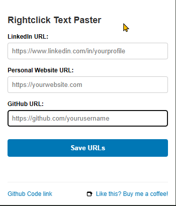
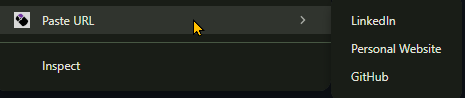
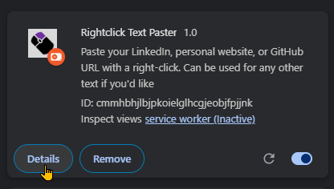
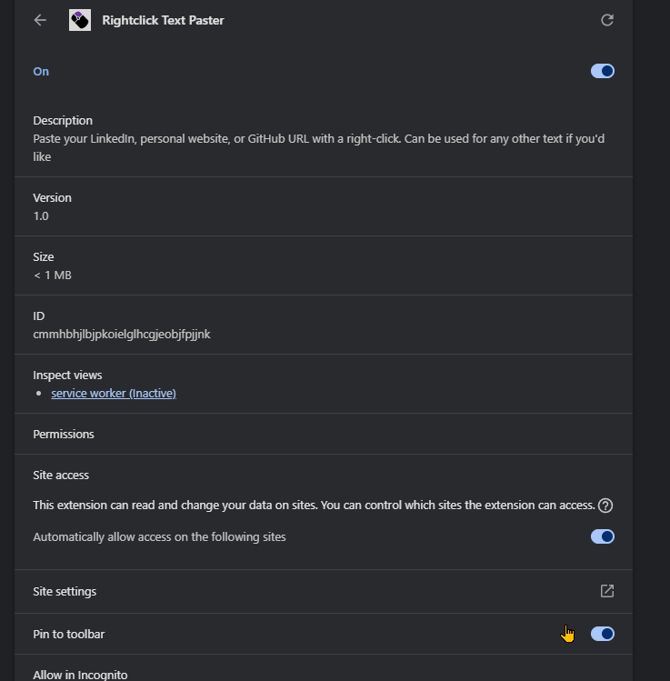

# Rightclick Text Paster - Chrome Extension

A simple Chrome extension that lets you save and paste frequently used URLs (or other text) with a right-click.

## Features

- Save up to 3 different URLs (LinkedIn, personal website, and GitHub)
- Paste them into any text field with a convenient right-click menu
- Simple and clean user interface
- Works on any website

## Installation

### From Chrome Web Store
https://chromewebstore.google.com/detail/oclkilggjaebogpeppghdbnokhpihoii?utm_source=item-share-cb

### Manual Installation
1. Download or clone this repository
2. Open Chrome and navigate to `chrome://extensions/`
3. Enable "Developer mode" (toggle in the top-right corner)
4. Click "Load unpacked" and select the extension folder
5. The extension icon should appear in your toolbar

## How to Use

1. Click the extension icon in your Chrome toolbar
2. Enter your frequently used URLs
3. Click "Save URLs"
4. When filling out a form online, right-click in any text field
5. Select "Paste URL" and choose which URL to paste

## Screenshots

TO SET IT UP ON THE TOOLBAR:
Go to Extensions in Chrome, click Details, and Pin to toolbar:

## Development

This extension is built using vanilla JavaScript and Chrome Extension Manifest V3.

### Files
- `manifest.json` - Extension configuration
- `popup.html` - User interface
- `popup.js` - Popup functionality
- `background.js` - Background processes and context menu

### Contributing

Feel free to fork this repository and submit pull requests for any improvements you'd like to add!

## License

MIT License

## Support

If you like this extension, feel free to send me a dollar or two on "Buy me a coffee" at https://www.buymeacoffee.com/zeevabrams
